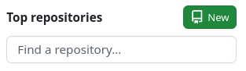
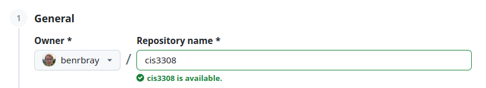
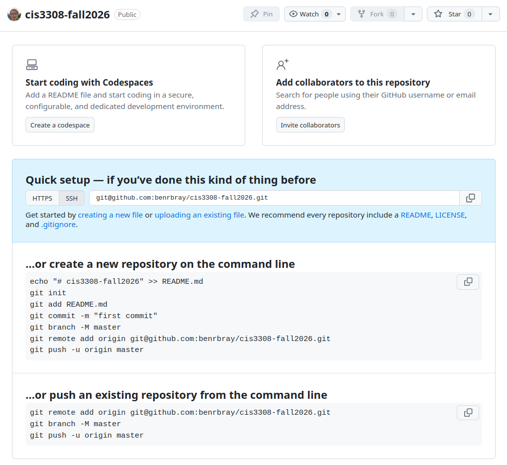

# Project 0:  Welcome to CIS 3308

**Deadline:**  Friday, September 4 (by the end of class)

Welcome to CIS 3308!  The goal of this project is to get you set up with your local development environment, and to 

This assignment is intended to be completed in a relatively short amount of time, so if you find yourself getting stuck, please reach out to me for help!

## Part 0:  System Setup

### Windows

If you have a Windows machine, I **strongly recommend** [Installing Windows Subsystem for Linux (WSL 2)](https://learn.microsoft.com/en-us/windows/wsl/install) and installing the software for this course inside of WSL, rather than directly within Windows.

Once you have WSL, simply follow the **Linux** instructions when installing new software.

Whenever you see instructions that say _"Open a new Terminal"_, you should open a new *Ubuntu/WSL Terminal*, and NOT PowerShell.

### Linux / Mac

If you are running Linux or MacOS, you're good to go!

## Part 1:  GitHub

**Git** is a version control system that developers use to keep track of changes to their code over time.  

**GitHub** is a website owned by Microsoft that enables free hosting of Git repositories.  At most companies, software engineers collaborate by using GitHub to share their code.

### 1a.  Sign up for a free GitHub Account

Visit https://github.com/ and choose *Sign Up*.

- Make sure you remember your password!

## Part 2:  Install Git

First, check whether you already have `git` installed by running the following terminal command:

```bash
$ git --version
git version 2.43.0
```

(_Note:_ The `$` indicates the start of a new terminal command.  Don't include the `$` symbol when typing the command yourself!)

If `git` is already installed, you will see a message with a version number, similar to the above.  If instead you see a message like `Command 'git' not found`, you should follow the [Git Installation Instructions](https://git-scm.com/install/) for your operating system.

## Part 2:  Set up Git SSH Keys

Follow all **5 steps** the [Connecting to GitHub with SSH](https://docs.github.com/en/authentication/connecting-to-github-with-ssh) instructions.

## Part 3:  Create a Git Repository

In your terminal, use the `cd` (change directory) and `mkdir` (make directory) commands to navigate to the folder where you'd like your project files to live.  For example:

```bash
$ cd ~
$ pwd
/home/ben/
$ mkdir projects
$ cd projects
$ pwd
/home/ben/projects
```

Now, create a folder to hold your project repository for this course.  Keep in mind that **everything you save in this folder will become _PUBLIC_**, so avoid placing any personal information or private files in this folder.  I recommend naming the folder `cis3308-public` as a reminder.

```bash
$ mkdir cis3308-public
$ cd cis3308-public
$ pwd
/home/ben/projects/cis3308-public
```

### Initialize the Repository

Now, we can initialize the `git` repository.  Run the following command:

```bash
$ git init
Initialized empty Git repository in /home/ben/temple/code/cis3308/public/.git/
$ ls -a
$ ls -a
.  ..  .git
```

### Checking `git status`

The `git init` command creates a new hidden folder named `.git` to store metadata and version history for our code repository.  We can check the current status of a git repository by running the following command:

```bash
$ git status
On branch master
No commits yet
nothing to commit (create/copy files and use "git add" to track)
```

The repository is currently empty, so we don't see much useful information yet!

### Creating a `README.md` File

Open *Visual Studio Code* in the same location as the `git` repository we created.  Create a new file named `README.md` with the following contents:

```markdown
# CIS 3308

This repository contains my public project files for CIS 3308.
```

After saving the file, run `git status` again from the command line.

```bash
$ git status
On branch master

No commits yet

Untracked files:
  (use "git add <file>..." to include in what will be committed)
	README.md

nothing added to commit but untracked files present (use "git add" to track)
```

This message tells us that `git` detected a new file named `README.md`, but that file is not part of the repository yet.  To add it, we need to run the following command:

```bash
$ git add README.md
```
```bash
$ git status
On branch master

No commits yet

Changes to be committed:
  (use "git rm --cached <file>..." to unstage)
	new file:   README.md
```

Now, `git status` tells us that the new file has been **staged**, and is ready to be **committed** (or saved) to the repository.  To commit all **staged changes**, run the following command:

```bash
$ git commit -m "created a README file"
[master (root-commit) f05a06c] created a README file
 1 file changed, 3 insertions(+)
 create mode 100644 README.md
```
```bash
$ git status
On branch master
nothing to commit, working tree clean
```

Now, `git status` tells us we have no unsaved changes.

## Part 4:  Create a GitHub Repository

1. Visit https://github.com/ while logged in to see your dashboard.
2. Click the `New` button to create a new repository.



3. Choose a descriptive *Name* for your repository (`cis3308`, `cis3308-projects`, etc.).  Make sure the repository is *Public*, then click the *Create Repository* button.



4. You'll be taken to an empty repository page that looks like this:



## Part 5:  Connect Local Git Repository with GitHub

Currently, you have two completely separate repositories.  We would like the repository on GitHub to mirror our local repository, so that we can share our code publicly (with classmates, teachers, coworkers, and the world!).

To establish a connection, follow the **...or push an existing repository from the command line** instructions.

```bash
# define a new remote named "origin" that points to GitHub
$ git remote add origin <YOUR_GIT_SSH_URL_HERE>
# ensures that the current branch is named "master", for consistency
$ git branch -M master
# synchronize your local copy of "master" with GitHub's copy of "master"
$ git push -u origin master
```

In `git` terminology, a `remote` is a separate copy of your repository that exists in another location (it could be a friend's computer, a company's server, or even just another folder on your local machine).

If you refresh the page, you should see your `README.md` file publicly on GitHub!